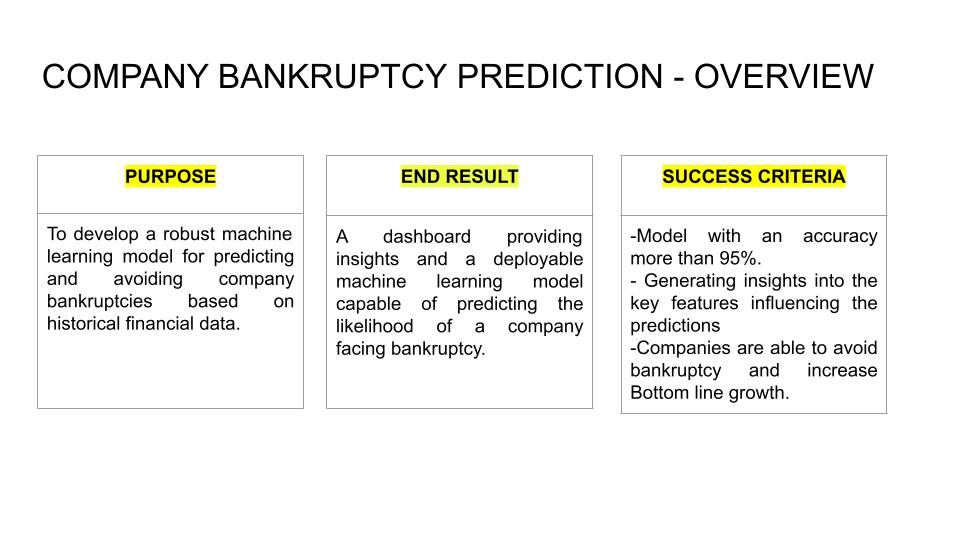
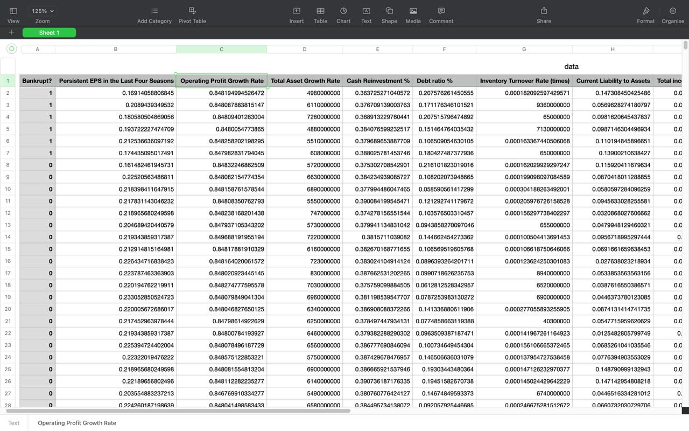

  <h1>Bankruptcy Oracle: Predictive Analytics for Businesses</h1>

    
  Utilizing logistic regression, this project predicts corporate bankruptcy by analyzing a comprehensive set of financial indicators, offering valuable insights for timely financial risk management.

<h2>Project Overview</h2>

    
  

<h2>Dataset</h2>

    
  

<h3>INFORMATION ABOUT DATASET</h3>   
Bankrupt: Targeted Variable  
Persistent EPS in the Last Four Seasons: EPS-Net Income  
Operating Profit Per Share (Yuan ¥): Operating Income Per Share  
Total Asset Growth Rate: Total Asset Growth  
Cash Reinvestment %: Cash Reinvestment Ratio  
Debt ratio %: Liability/Total Assets  
Inventory Turnover Rate (times)  
Current Liability to Assets  
Total income/Total expense  
Equity to Long-term Liability  
Cash Flow to Equity  
Current Liability to Current Assets  
Gross Profit to Sales  
Equity to Liability  
<h2>EDA</h2>

    
  

<h2>Data Visualisation</h2>

    
    
  

